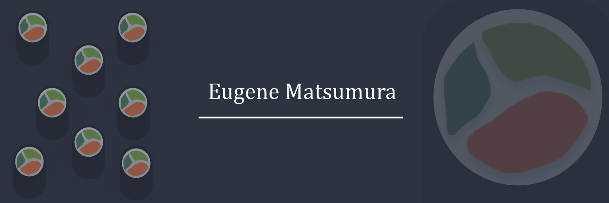

<h1 align="center">
Hi there, I'm Eugene! 👋
</h1>

Random guy on github, love to make stuff with the Unity Engine. I also do full stack development with typescript.

---

### Connect with me 🤝

---

### Technologies I use 📱

You can see my technologies I learned and planned to learn on my [Technologies-To-Learn](https://github.com/SushiWaUmai/Technologies-To-Learn) repository.

---

### Coding Stats 📈

---

### My Repositories ✨

